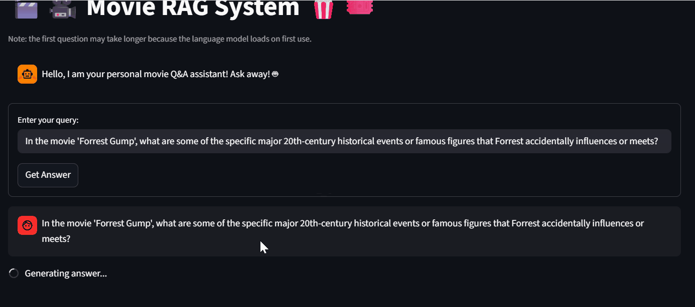
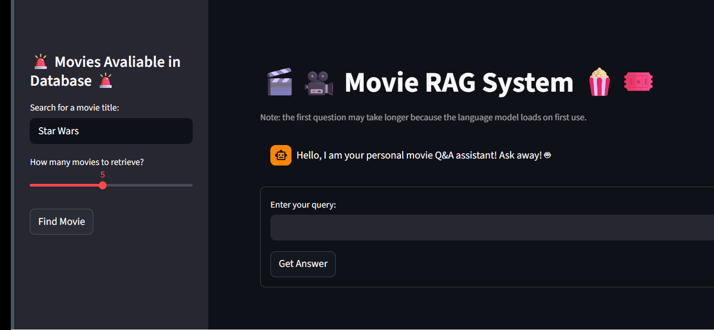
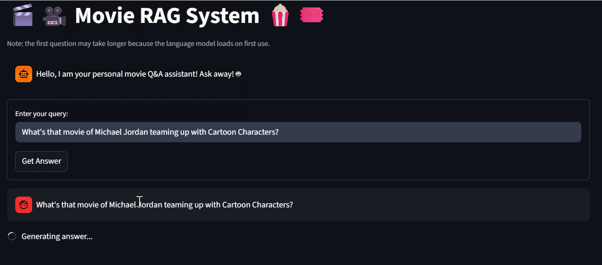

# 🎬 **Movie RAG System** 🎥


> 🚀 A Retrieval-Augmented Generation system for intelligent movie search and discovery.

> 🔍 Ask anything about movies — get accurate, data-grounded answers powered by RAG + LLMs.

---

## Table of Contents 
- [Overview](#-overview)
- [Demo](#-demo)
- [Installation](#-installation)
- [Usage](#️-usage)
- [Features](#-features)
- [Tech Stack](#-tech-stack)
- [How It Works](#-how-it-works)
- [Project Structure](#-project-structure)
- [Data Sources](#-data-sources)
- [Evaluation](#-evaluation)
- [Full Reproduction](#-full-reproduction-pipeline)
- [Future Improvements](#-future-improvements)

---

## 📌 Overview
This project implements a Retrieval-Augmented Generation (RAG) system for answering movie-related questions.

It supports multiple query types, including:
- plot-based questions 
- actor and character lookups 
- metadata retrieval
- recommendation-style queries

Designed for movie fans, students, and developers seeking accurate, data-grounded film insights.

---

## 📸 Demo

### 🎥🍿 Live Demo
👉 [Watch on YouTube](https://youtu.be/107usbwWhow?si=lm6dqRxsn1LxVp0t)

### 💬 Example Usage

#### Interactive Chat



#### Movie Search Bar



---

## 📦 Installation

### ⚡ Quick Demo (Recommended)
Run the app directly in Google Colab:

1. Open `app_demo/run_movie_rag_streamlit_app.ipynb`
2. Install dependencies:
```
python
!pip install streamlit pyngrok chromadb sentence-transformers transformers accelerate bitsandbytes
```
3. Add your Ngrok authtoken
4. Run all cells

---

## 🛠️ Usage

### Ask Questions Like:
- "What movie is about a sinking ship and a love story?"
- "Who plays Katniss Everdeen?"
- "Recommend movies similar to The Karate Kid"

### What You Get:
- Context-aware answers grounded in real movie data
- Fast retrieval using vector similarity search
- Interactive chat + search interface

---

## ✨ Features
- Interactive Chatbot 🤖

- Side Search Bar 🔍
   - Finds movies in database


---

## 🧰 Tech Stack

- **LLM:** Mistral-7B-Instruct (4-bit quantized)
- **Embeddings:** Sentence Transformers (all-mpnet-base-v2)
- **Vector DB:** ChromaDB
- **Framework:** Streamlit
- **Deployment:** Google Colab + Ngrok

---

## 🧠 How It Works

The system follows a standard RAG pipeline:

1. **Data Preparation**
   - Movie plots, metadata, and character data are cleaned and merged  

2. **Chunking**
   - Plot summaries are split using a sentence-based chunking strategy  

3. **Embedding**
   - Text chunks are converted into emeddings using: 
      - Sentence Transformers **all-mpnet-base-v2** model

4. **Vector Storage**
   - Embeddings are stored in a **ChromaDB** vector database  

5. **Retrieval**
   - Relevant chunks are retrieved based on user query similarity  

6. **Generation**
   - **Mistral-7B-Instruct** model generates responses using retrieved context  

7. **App Deployment**
    - Streamlit app run in Google Colab to leverage GPU resources for inference
    - Ngrok is used to create a secure public tunnel to the locally running Streamlit server

---

## 📁 Project Structure
```
movie-rag-system/
├── app_demo/
│   ├── build_movie_names_vectordb.py
│   ├── get_movie_names_embeddings.py
│   ├── movie_rag_app.py
│   ├── movie_rag_pipeline.py
│   ├── run_movie_rag_streamlit_app.ipynb
├── assets/
│   ├── query1.gif
│   ├── query2.gif
│   ├── query3.gif
├── data/
│   ├── movie_rag_eval_dataset.json
│   ├── movie_rag_evaluation.csv
├── evaluation/
│   ├── evaluate_mistral_responses.ipynb
│   ├── evaluation_explanations.md
│   ├── evaluation_summary.md
│   ├── run_movie_rag_eval.py
│   ├── testing.md
├── notebooks/
│   ├── build_movie_chunks_vectordb.ipynb
│   ├── chunk_movie_data.ipynb
│   ├── movie_rag_testing.ipynb
│   ├── plot_cleaning_breakdown.md
│   ├── prepare_movie_data.ipynb
├── .gitignore
├── README.md
```

---

## 📊 Data Sources

The dataset used in this project is derived from the CMU Movie Summary Corpus:

- CMU Movie Summary Corpus: https://www.cs.cmu.edu/~ark/personas/

The dataset used in this project includes:
- Movie metadata (genres, release dates, etc.)
- Character metadata
- Movie plot summaries

This data was collected by David Bamman, Brendan O'Connor, and Noah Smith at the Language Technologies Institute and Machine Learning Department at Carnegie Mellon University.

## 📈 Evaluation

- 30 test queries across multiple categories:
  - plot-based
  - metadata lookup
  - recommendation

- Each query evaluated against:
  - 3 reference answers (Google, ChatGPT, AI Movie Finder: https://www.aimoviefinder.com/)

### Evaluation Table

These results indicate strong semantic similarity performance (high BERTScore),
while traditional n-gram metrics (BLEU, ROUGE) remain lower due to the generative nature of LLM responses.

| Metric                | Value     | 
|-----------------------|-----------|
| **Average Precision**  | 0.55      |
| **Average Latency**    | 13.73     | 
| **BERTScore**          | 0.8861    |
| **ROUGE-1 F1**         | 0.3325    | 
| **ROUGE-2 F1**         | 0.1607    | 
| **ROUGE-L F1**         | 0.2714    | 
| **METEOR**             | 0.4255    | 
| **BLEU**               | 0.0729    | 
| **ChrF**               | 39.6788   | 
| **TER**                | 302.4843  | 

See `/evaluation/` for more details.

---

## 🧪 Full Reproduction (Pipeline)

1. Store CMU data files locally 
- [Data Sources](#-data-sources)
   - `character.metadata.tsv`
   - `movie.metadata.tsv`
   - `plot_summaries.txt`
2. Run Data Preprocessing notebooks/scripts
- `prepare_movie_data.ipynb`
- `chunk_movie_data.ipynb`
- `build_movie_chunks_vectodb.ipynb`
- `get_movie_names_embeddings.py`
- `build_movie_names_vector_db.py`
3. Ensure Chroma collections are created and saved in Google Drive
4. Run Streamlit app
- Ensure the following are in Google Drive or uploaded into the Colab Notebook:
   - `movie_rag_pipeline.py`
   - `movie_rag_app.py`
- Get Ngrok **Authtoken**
   - Ngrok is free and a profile can be easily created using your Github Account
   - https://ngrok.com/docs/start
- Run:
   - `run_movie_rag_streamlit_app.ipynb`

---

## 🚀 Future Improvements

- Improve chunking strategy (LangChains: recursive or character text splitter)
- Implement hybrid retrieval (BM25 + dense embeddings)
- Deploy outside Colab (Docker / cloud hosting)
- Add user feedback loop for ranking results